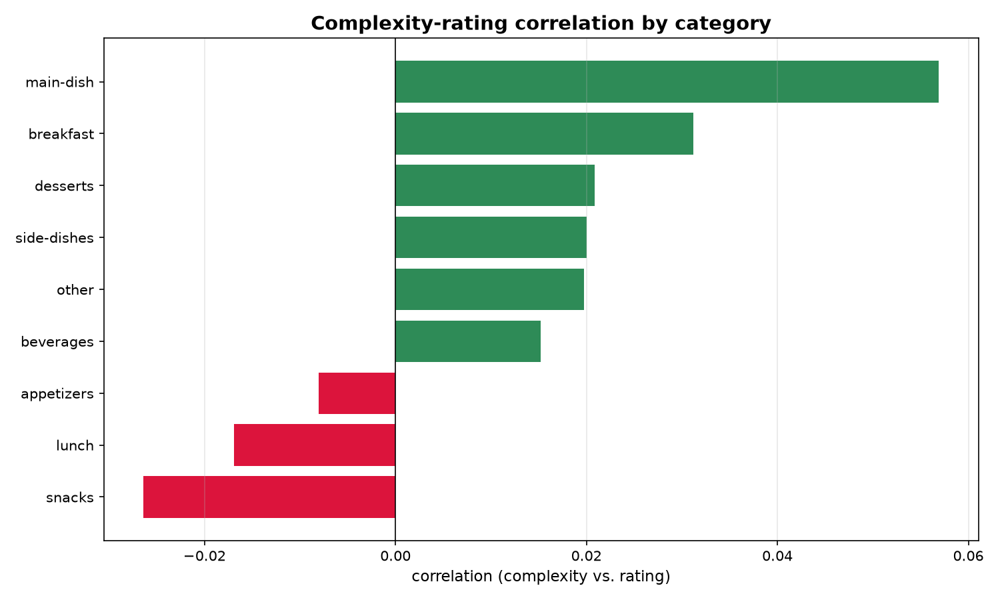

# 🍲 Recipe Rescue

**What actually makes a recipe get 1-star reviews — complexity, category, or something else?**

This project uses the public Food.com recipes-and-interactions dataset from Kaggle (recipe details in `RAW_recipes.csv`, user ratings and reviews in `RAW_interactions.csv`) to analyze whether complexity (ingredient count, step count, total time) predicts rating, and whether that relationship differs by category.

Built as a hands-on project to practice: Python fundamentals, NumPy vectorized operations, Pandas DataFrames, boolean/filtering logic, joining and aggregating data, and reshaping/pivoting data — plus an optional small-scale web-scraping exercise.

---



## 🎯 Project Questions

- Do recipes with more ingredients/steps rate worse, better, or about the same?
- Does the complexity-rating relationship differ across categories (desserts vs. quick dinners)?
- Are there "hidden gem" recipes — high rating, low review count?
- Is total time (the dataset's single `minutes` value) a better or worse predictor of rating than ingredient count?

## Findings

1. **Ingredient/step count vs. rating:** No meaningful relationship (r ≈ -0.001) — simple and complex recipes rate about the same.
2. **Complexity-rating relationship by category:** Correlations range from -0.03 to 0.06 across categories — direction and strength vary slightly, but none show a strong pattern.
3. **Hidden gems:** 15,304 recipes identified as highly-rated but under-reviewed (z-score > 0.75 within category, review count below the median).
4. **Time vs. ingredients as predictors:** Neither predicts rating well — minutes (r ≈ -0.023) is a slightly stronger (though still weak) predictor than ingredient count (r ≈ -0.001).

---

## 📁 Repository Structure

```
recipe-rescue/
├── data/
│   ├── raw/                # RAW_recipes.csv and RAW_interactions.csv (untouched, git-ignored)
│   └── processed/          # Cleaned, feature-engineered, analysis-ready data
│
├── notebooks/               # Exploratory analysis, step-by-step, one notebook per phase
│   ├── 01_scrape_explore.ipynb   # Loads and inspects the Kaggle CSVs, aggregates ratings
│   ├── 02_clean_features.ipynb
│   ├── 03_filtering_questions.ipynb
│   ├── 04_pivot_complexity_rating.ipynb
│   └── 05_numpy_stats_plots.ipynb
│
├── src/                      # Reusable code, imported by notebooks/scripts (not copy-pasted)
│   ├── __init__.py
|   |
│   ├── clean.py              # Parsing/feature functions (ingredient count, minutes cleaning,
│   │                         #   nutrition split, category assignment)
│   └── analysis.py           # Pivoting, correlation, z-score, bucketing helpers
│
│
├── outputs/            # Saved charts/plots (PNG)
│
├── .gitignore
├── requirements.txt
├── learning_skill.txt        # Skill-by-skill practice guide for this project
└── README.md
```

---

## 🛠️ Setup

```bash
git clone <your-repo-url>
cd recipe-rescue
python -m venv venv
source venv/bin/activate       # Windows: venv\Scripts\activate
pip install -r requirements.txt
```

Then download the dataset from Kaggle ("Food.com Recipes and Interactions") and place
`RAW_recipes.csv` and `RAW_interactions.csv` in `data/raw/`.

> The two files are large (roughly 295 MB and 350 MB), which is over GitHub's 100 MB file
> limit, so add `data/raw/` to `.gitignore` and don't commit them.

---

## 🚀 Usage

1. **Add the data** — put `RAW_recipes.csv` and `RAW_interactions.csv` in `data/raw/`
2. **Clean & engineer features** (fills `data/processed/`)
   ```bash
   python -m src.clean
   ```
3. **Explore in notebooks**, in order, starting with `notebooks/01_scrape_explore.ipynb`

---

## 📊 Skills Practiced

| Skill                                                                        | Where                                          |
| ---------------------------------------------------------------------------- | ---------------------------------------------- |
| Python fundamentals (functions, control flow)                                | `src/clean.py`                                 |
| Pandas Series/DataFrame basics, merging and aggregating (`groupby`, `merge`) | `notebooks/01`, `notebooks/02`, `src/clean.py` |
| Parsing messy columns (stringified lists, nutrition, tags)                   | `notebooks/02`, `src/clean.py`                 |
| Filtering & boolean indexing                                                 | `notebooks/03`                                 |
| Reshaping / pivoting (`pivot_table`, `melt`)                                 | `notebooks/04`, `src/analysis.py`              |
| NumPy vectorized ops (correlation, z-scores, bucketing)                      | `notebooks/05`, `src/analysis.py`              |

---

## 📈 Sample Finding

> Recipe complexity — ingredient count, step count, or time — has almost no bearing on how well a recipe is rated. What matters more is visibility: thousands of highly-rated recipes are sitting with very few reviews, effectively undiscovered.

---

## 📄 Data Sources

- Recipe data: the Kaggle [Food.com Recipes and Interactions](https://www.kaggle.com/datasets/shuyangli94/food-com-recipes-and-user-interactions) dataset
  - `RAW_recipes.csv` — one row per recipe: name, id, minutes, tags, nutrition, steps,
    ingredients, and more
  - `RAW_interactions.csv` — one row per rating/review (a rating of 0 means a review with
    no score, so it is excluded from averages)

---

## 🔭 Possible Extensions

- Add basic NLP on the `review` text (most common complaint words for low-rated recipes)
- Rank the top 10 hidden gems by rating and surface them in a dedicated view
- Build a small Streamlit app to filter recipes by "quick + highly rated"
